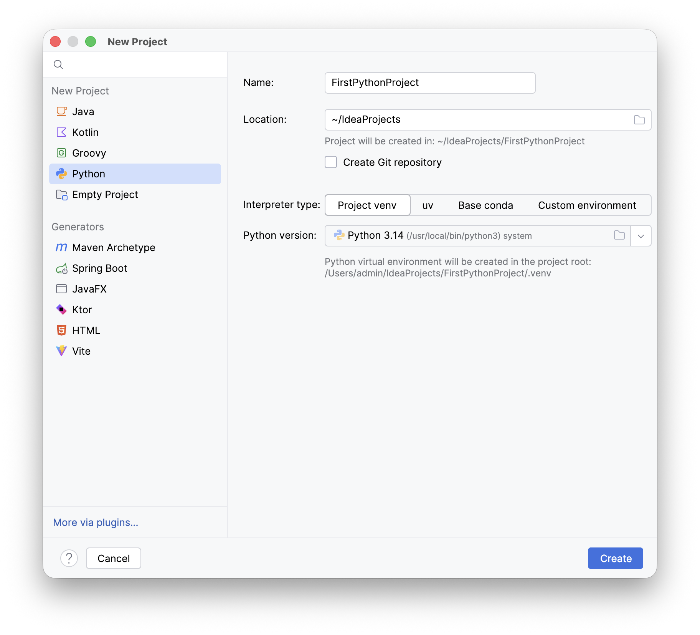
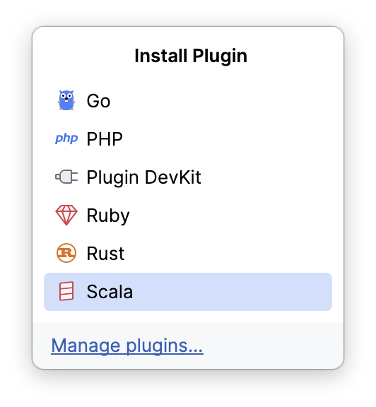
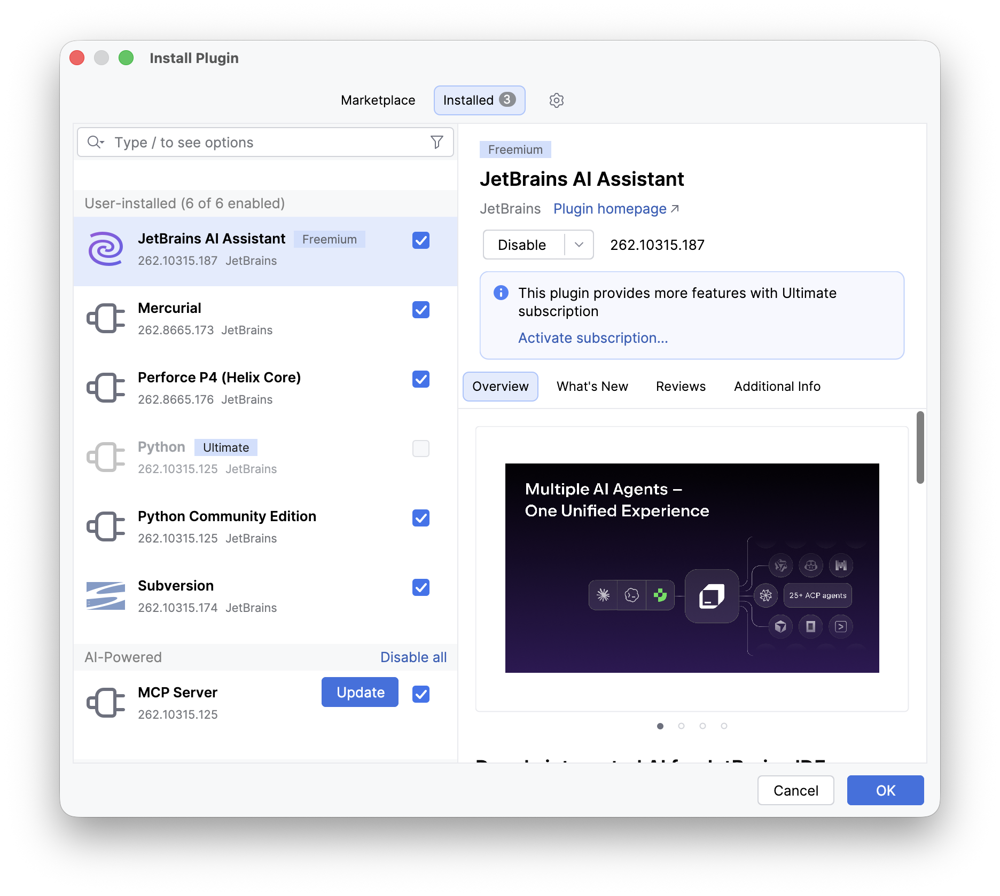
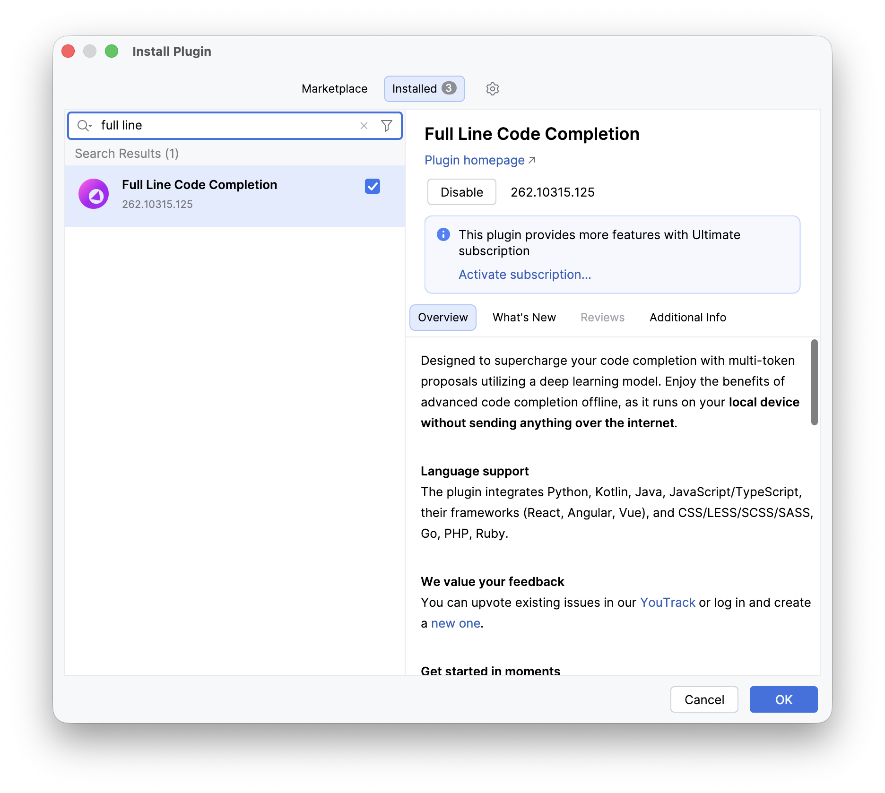
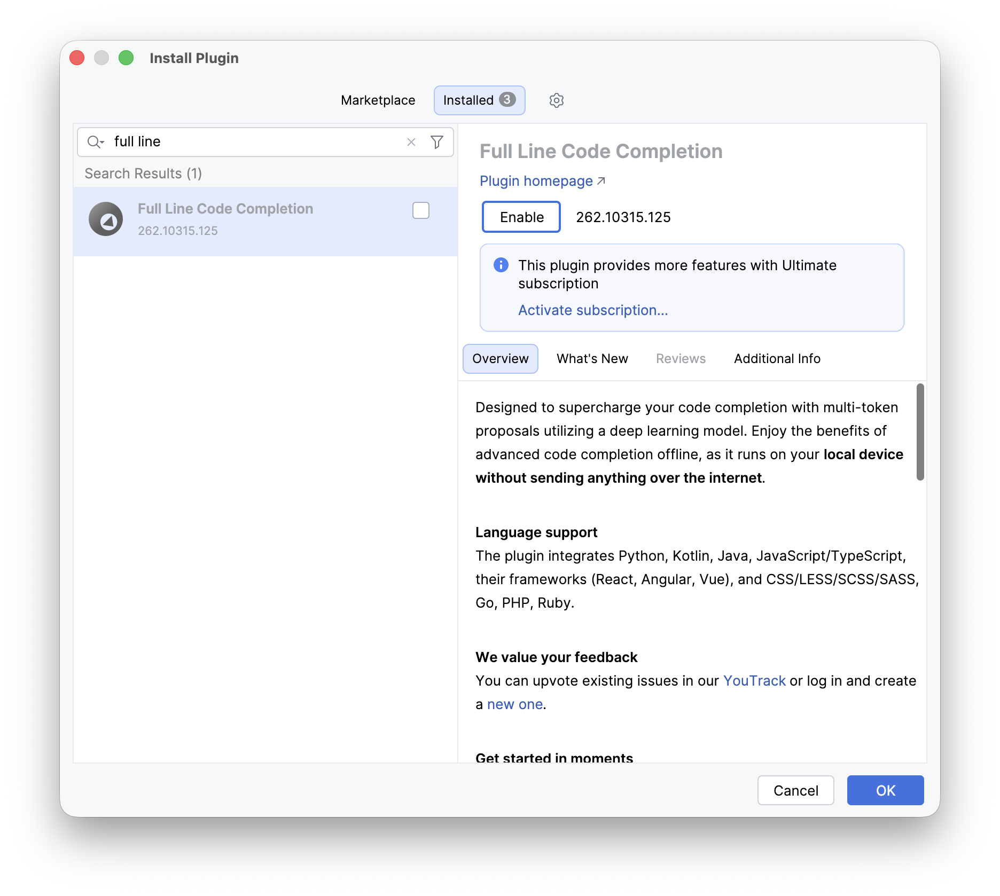
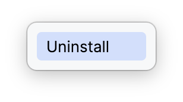
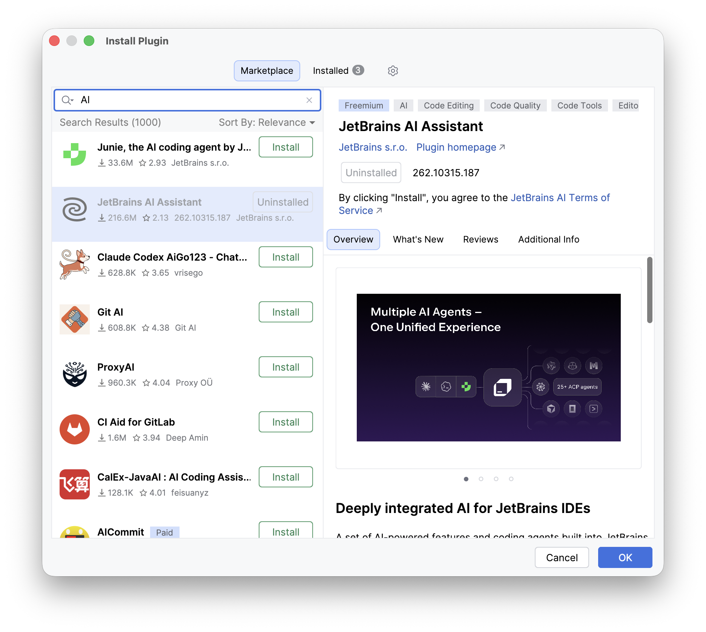

# Désactiver l’assistance IA dans IntelliJ IDEA

**macOS — JetBrains AI Assistant et Full Line Code Completion**

## 1. Ouvrir le gestionnaire de plugins

**Depuis la fenêtre « New Project » :**

1) Cliquer sur **More via plugins…**, en bas à gauche.

\begin{center}

{width=10cm}

\end{center}

2) Dans le menu qui s’ouvre, cliquer sur **Manage plugins…**.

\begin{center}

{width=3cm}

\end{center}

**Depuis un projet ouvert :** ouvrir le menu **IntelliJ IDEA → Settings…**
(raccourci **Cmd + virgule**), puis sélectionner **Plugins**. Depuis la fenêtre d’accueil,
il est aussi possible de cliquer directement sur **Plugins**.

Les étapes suivantes sont communes à ces accès.

```{=openxml}
<w:p><w:r><w:br w:type="page"/></w:r></w:p>
```

```{=latex}
\newpage
```

## 2. Désactiver JetBrains AI Assistant

1) Cliquer sur l’onglet **Installed**. Sélectionner **JetBrains AI Assistant**
dans la liste. Si nécessaire, saisir **AI Assistant** dans la barre de recherche.

2) Cliquer sur **Disable**, ou décocher la case à droite du nom du plugin.
La capture ci-dessous montre le plugin **encore activé**, avant cette action.

\begin{center}

{width=15cm}

\end{center}

3) Vérifier que la case est décochée et que le bouton propose **Enable**.
Passer ensuite à la désactivation de **Full Line Code Completion** (page suivante).

Si **JetBrains AI Assistant** n’apparaît pas dans **Installed**, il n’est pas
installé : passer à l’étape suivante.

```{=openxml}
<w:p><w:r><w:br w:type="page"/></w:r></w:p>
```

```{=latex}
\newpage
```

## 3. Désactiver Full Line Code Completion

1) Dans **Installed**, remplacer la recherche par **full line**. Sélectionner
**Full Line Code Completion**, puis cliquer sur **Disable** ou décocher sa case.

\begin{center}

{width=9.5cm}

\end{center}

2) Vérifier que la case est vide, que le nom est grisé et que le bouton affiche
**Enable**, comme ci-dessous. Cela indique que le plugin est désactivé.

\begin{center}

{width=9.5cm}

\end{center}

3) Cliquer sur **OK** pour valider les changements. Si IntelliJ IDEA demande un
redémarrage, cliquer sur **Restart**. Vérifier ensuite dans **Installed** que les
deux plugins sont désactivés, ou que **JetBrains AI Assistant** est désinstallé.

```{=openxml}
<w:p><w:r><w:br w:type="page"/></w:r></w:p>
```

```{=latex}
\newpage
```

## 4. Facultatif : désinstaller JetBrains AI Assistant

La désactivation suffit pour ce tutoriel. Pour supprimer aussi le plugin,
sélectionner **JetBrains AI Assistant**, ouvrir la flèche à côté de **Disable**
(ou **Enable** s’il est déjà désactivé), puis cliquer sur **Uninstall**.

\begin{center}

{width=3cm}

\end{center}

La capture suivante montre le résultat de cette opération : le plugin est grisé
et porte la mention **Uninstalled**. Ici, il est affiché dans **Marketplace**
après une recherche **AI**.

\begin{center}

{width=14cm}

\end{center}

Cliquer sur **OK**, puis sur **Restart** si un redémarrage est demandé.
**Full Line Code Completion doit également rester désactivé.**

Référence : [documentation JetBrains — gestion des plugins](https://www.jetbrains.com/help/idea/managing-plugins.html).
